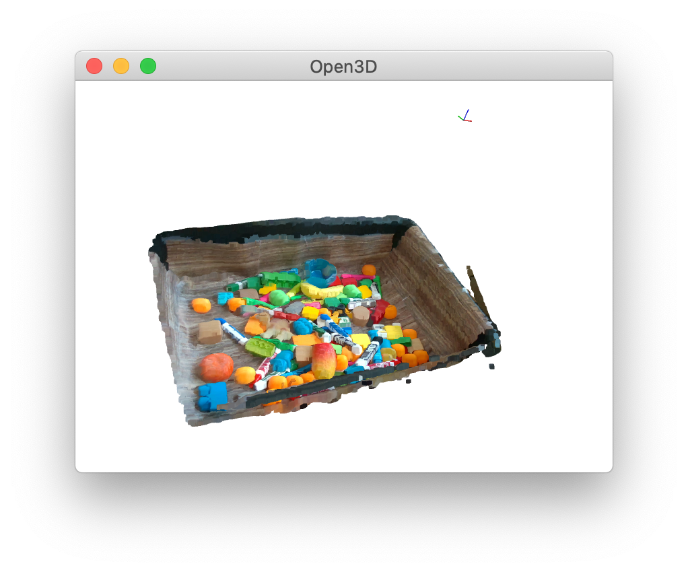
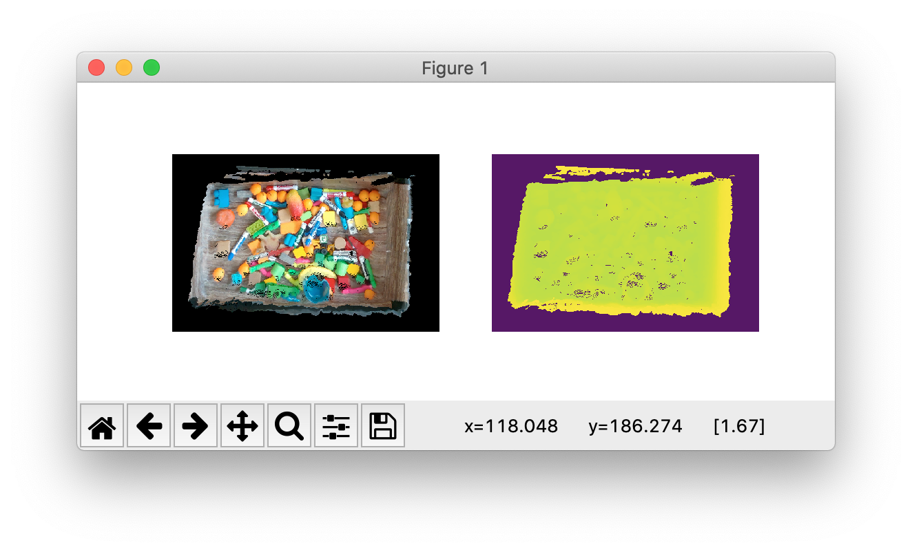

# Pointcloud

This module provides a unifying `PointCloud` class for simplifying the user's interaction with RGB-D images.

## API

You can instantiate a point cloud instance from a pair of RGB-D images, or from an already-formed point cloud.

<p align="center">
 
</p>

```python
# from an rgb-d pair
pc = PointCloud(color_im, depth_im, cam_intr)  # note RGB image can be grayscale
pc.make_pointcloud(extrinsics=cam_pose, trim=True)

# from an existing point cloud
pc = PointCloud.from_point_cloud(xyzrgb, cam_intr, (480, 640), cam_pose)
```

Once the point cloud instance is created, you can transform it, and visualize it.

```python
# apply some random 4x4 transform and visualize
pc_tr = PointCloud.transform_point_cloud(pc, transform)
pc_tr.view_point_cloud()
```

<p align="center">
 
</p>

You can also create and visualize an orthographic top-down representation of the point cloud.

```python
pc.make_heightmap(cam_pose, view_bounds, pixel_size, zero_level)
pc.view_height_map()
```

<p align="center">
 
</p>

Finally, you can access the created representations for downstream manipulations:

```python
point_cloud = pc.point_cloud
height_map_color = pc.height_map_color
height_map_depth = pc.height_map_depth
```

## Todos

- [ ] Add interpolation of heightmaps to fill in black holes when increasing spatial resolution.